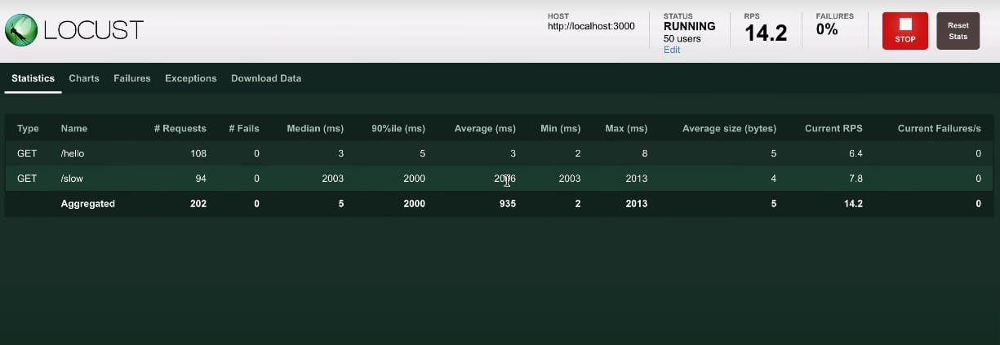
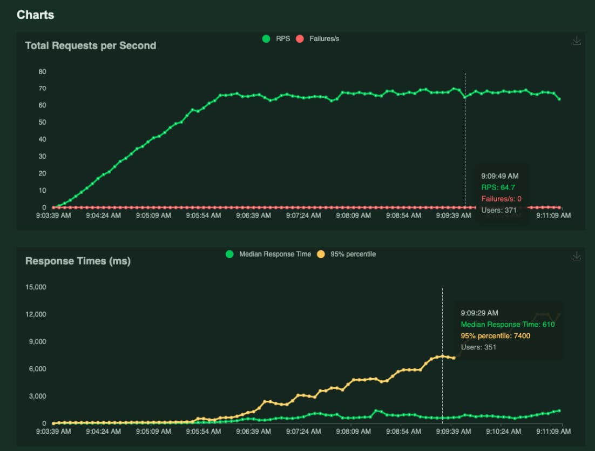

# MANUAL DE USUARIO 

**Graficas**

1. En la grafica de pastel se ven los porcertajes de los  tweets por pais

2. El numero **2441** que vemos en la pantalla es la catidad de  tweets 

3. El numero **87** Indica los países participantes

4. La grafica que esta debajo de los numero es la cantidad total de tweets de forma individual.

5. La grafica que esta en la parte inferior es la cantidad de tweets por paise

**Locust**
Locust es una herramienta de código abierto utilizada para pruebas de carga. Está diseñada para simular el comportamiento de múltiples usuarios accediendo a una aplicación web al mismo tiempo, con el fin de evaluar su rendimiento bajo condiciones de alto tráfico. A continuación, se detallan algunos aspectos clave de Locust:

¿Qué es Locust?

1. Locust es un framework de pruebas de carga que permite crear scripts de prueba en Python, donde los usuarios virtuales pueden realizar diversas acciones en una aplicación web.
2. Es un proyecto de código abierto, lo que significa que está disponible de forma gratuita y puede ser modificado y mejorado por la comunidad.

¿Para qué sirve Locust?
1. Pruebas de Carga: Locust se utiliza principalmente para realizar pruebas de carga en aplicaciones web, simulando un gran número de usuarios concurrentes.
2. Evaluación de Rendimiento: Ayuda a identificar cuellos de botella y problemas de rendimiento en la aplicación al observar cómo se comporta bajo diferentes niveles de carga.
3. Escalabilidad: Permite simular miles o incluso millones de usuarios mediante la distribución de la carga en múltiples máquinas.

En este proyecto el uso de Locust sería simular el acceso de miles de usuarios a un sitio que creamos para observar cómo se comporta el servidor y asegurarse de que puede manejar el tráfico sin fallar.