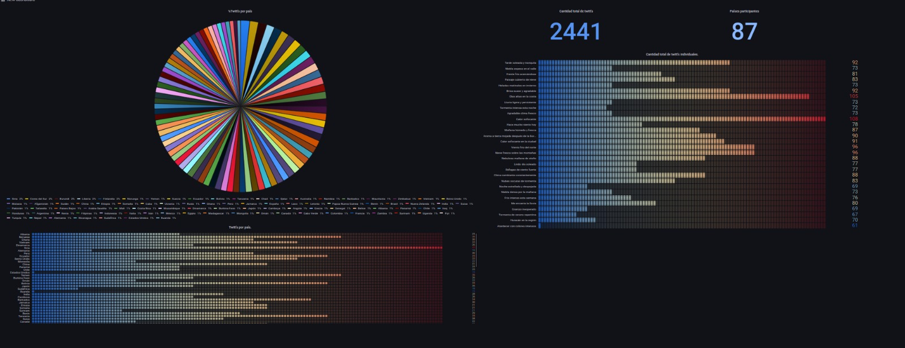

# MANUAL DE USUARIO 

**Graficas**

1. En la grafica de pastel se ven los porcertajes de los  tweets por pais

2. El numero **2441** que vemos en la pantalla es la catidad de  tweets 

3. El numero **87** Indica los países participantes

4. La grafica que esta debajo de los numero es la cantidad total de tweets de forma individual.

5. La grafica que esta en la parte inferior es la cantidad de tweets por paise